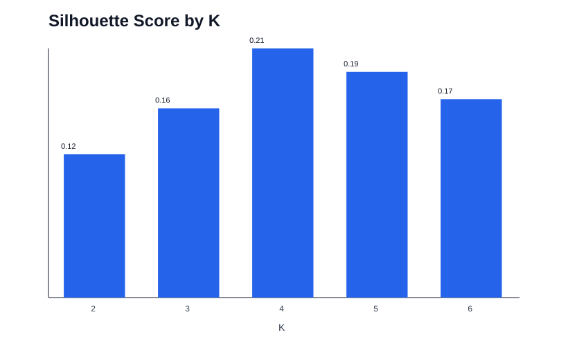
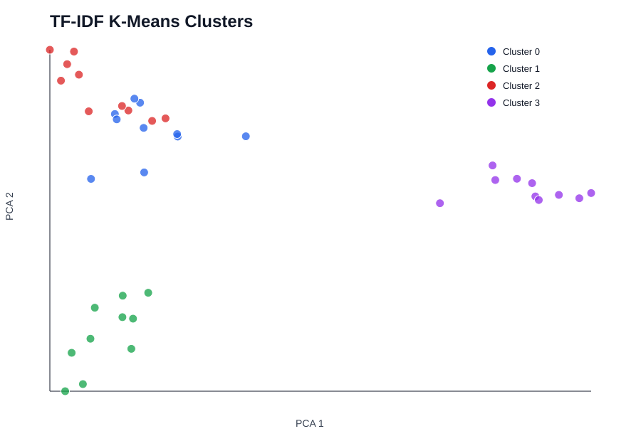

# Data Mining Text Clustering

Recruiter-ready data mining and visualisation project for unsupervised sentence clustering.

This repository is a clean portfolio version inspired by a rough Data Mining and Visualisation assignment. It does not include university briefs, answer sheets, grading feedback, private datasets, messy submission files or coursework PDFs.

## Problem Statement

Text datasets often arrive without labels. Clustering helps group similar sentences so analysts can inspect themes, identify structure and support downstream search, reporting or topic analysis.

This project builds a reproducible text clustering workflow using:

- text preprocessing,
- TF-IDF vectorisation,
- K-Means clustering,
- silhouette-based K selection,
- PCA visualisation,
- cluster interpretation with top terms.

## Dataset

The original assignment used a private TSV sentence dataset with `ID` and `Sentence` columns. That dataset is not published in this repository.

To keep the project runnable and safe to share, this repository includes a small synthetic demo corpus:

```text
data/sample_sentences.tsv
```

The demo corpus contains 40 short sentences across four broad themes:

- data analytics,
- healthcare,
- energy and sustainability,
- careers and portfolios.

You can replace it with your own permitted TSV file:

```text
ID<TAB>Sentence
1<TAB>Your sentence here
2<TAB>Another sentence here
```

## Methodology

### Preprocessing

The text cleaning pipeline:

- lowercases text,
- removes non-letter characters,
- removes common English stopwords,
- removes one-character tokens,
- preserves the original sentence for interpretation.

### TF-IDF Baseline

The project uses a dependency-light TF-IDF implementation as the reproducible baseline. The generated run used:

- minimum document frequency: 2,
- maximum features: 120,
- L2-normalised TF-IDF vectors.

### Optional Embedding Extension

The rough project explored a sentence-transformer style semantic embedding workflow. The public repo keeps TF-IDF as the default because it can be regenerated without downloading large models. An optional extension note is included in `src/sentence_transformer_optional.py`.

### Clustering

K-Means is run across a tested K range. The best K is selected using silhouette score with cosine distance.

### Visualisation

PCA projects the TF-IDF vectors into two dimensions for a cluster map. This is only a visual aid; final cluster quality should be interpreted using both metrics and the top terms.

## Generated Results

The committed results were generated from the current code and the safe synthetic demo corpus.

| Metric | Value |
|---|---:|
| Documents | 40 |
| TF-IDF vocabulary size | 78 |
| Tested K values | 2 to 6 |
| Selected K | 4 |
| Selected silhouette score | 0.2111 |
| Cluster sizes | 10 / 10 / 10 / 10 |
| PCA explained variance, component 1 | 0.0939 |
| PCA explained variance, component 2 | 0.0894 |

Full metrics are stored in [`results/metrics.json`](results/metrics.json).

## Visual Results

### Silhouette Scores



### PCA Cluster Map



## Cluster Interpretation

Top terms from the generated run:

| Cluster | Interpreted theme | Top terms |
|---:|---|---|
| 0 | Data analytics | data, analytics, reporting, dashboards, metrics, business |
| 1 | Career and portfolio | career, portfolio, evidence, CV, project, skills |
| 2 | Energy and sustainability | energy, grid, renewable, consumption, demand, electricity |
| 3 | Healthcare | clinical, patient, treatment, medication, healthcare, safety |

## How To Run

Create an environment:

```bash
python -m venv .venv
.venv\Scripts\activate
pip install -r requirements.txt
```

Run the demo experiment:

```bash
python src/experiment.py --data-path data/sample_sentences.tsv --output-dir results --min-k 2 --max-k 6 --min-df 2 --max-features 120
```

Run with your own permitted TSV:

```bash
python src/experiment.py --data-path data/private/my_sentences.tsv --output-dir results/my_run --min-k 2 --max-k 10
```

Private datasets should be kept under `data/private/`, which is ignored by Git.

## Repository Structure

```text
data-mining-text-clustering/
  README.md
  requirements.txt
  data/
    sample_sentences.tsv
  src/
    preprocessing.py
    tfidf.py
    clustering.py
    visualisation.py
    experiment.py
    sentence_transformer_optional.py
  notebooks/
    README.md
  reports/
    experiment_card.md
  results/
    metrics.json
    cluster_assignments.csv
    cluster_terms.csv
    silhouette_scores.svg
    pca_cluster_map.svg
```

## Limitations

- The committed demo dataset is synthetic and small.
- TF-IDF captures lexical overlap better than deep semantic similarity.
- The silhouette score is moderate, so clusters should be interpreted carefully.
- PCA is a simplified 2D view of high-dimensional text features.
- Cluster themes require human interpretation.
- Results will change when using the original private dataset or another permitted corpus.

## Future Improvements

- Add sentence-transformer embeddings when model downloads are permitted.
- Add MiniBatchKMeans for larger datasets.
- Add t-SNE or UMAP visualisation.
- Add cluster stability checks across random seeds.
- Add automatic cluster naming from top terms.
- Add an interactive cluster review dashboard.

## Academic Integrity Note

This repository is designed as a public portfolio project. It intentionally excludes private university material, raw assignment submissions, grading material and restricted datasets.
